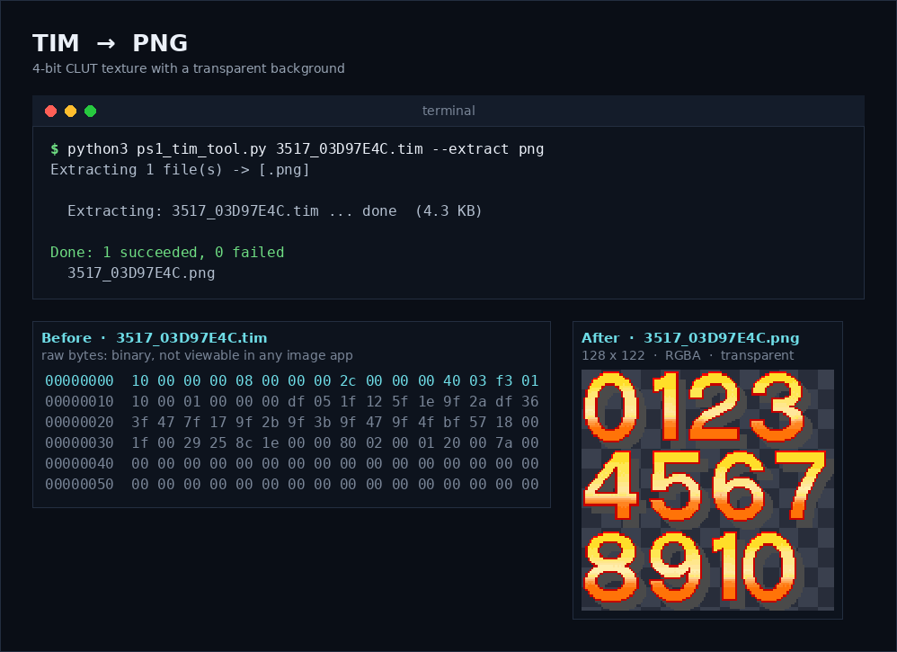
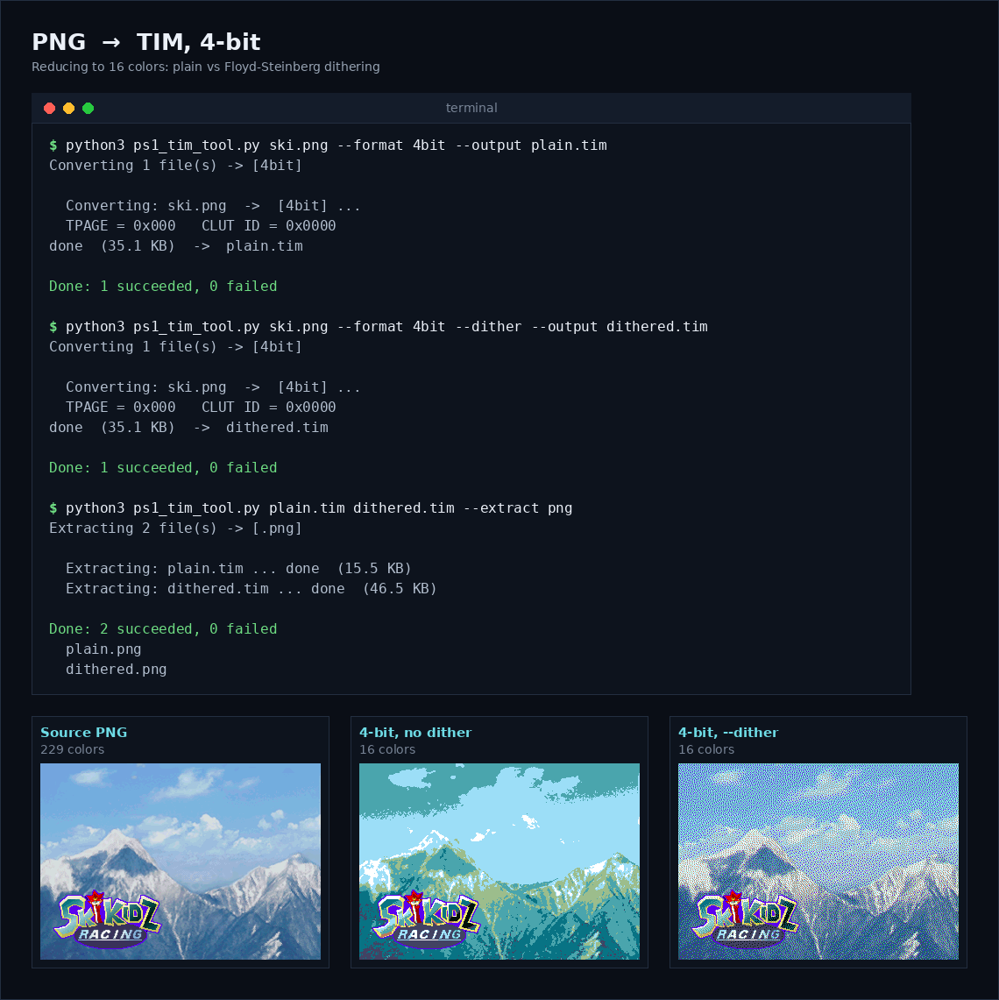
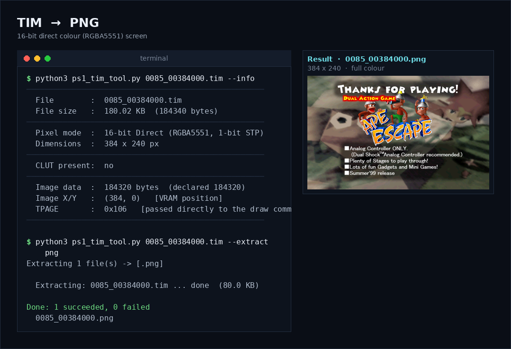
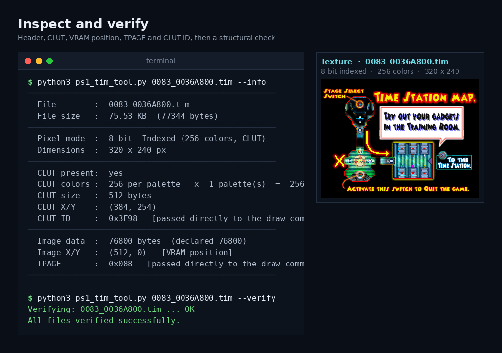
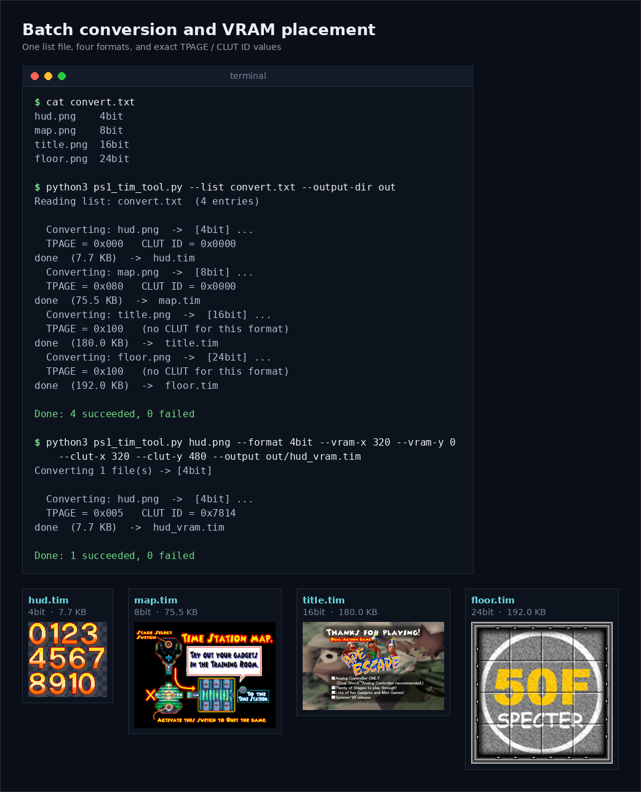
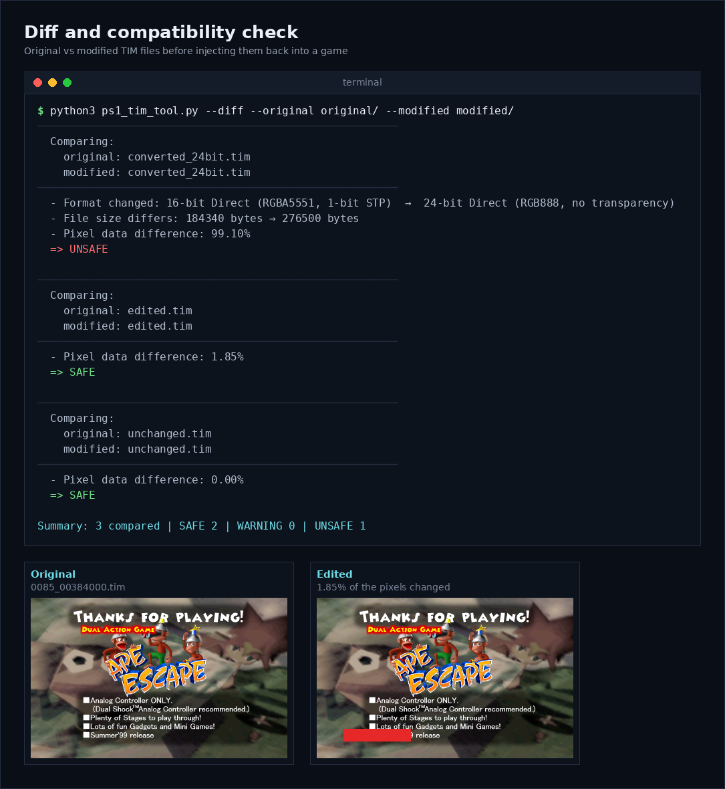

# PS1 TIM Tool

⭐ If this tool saved you time, consider starring the repo. It helps others find it too.

A command-line converter between standard image formats and Sony's official **TIM** texture format for the original PlayStation (PS1).

Convert PNG/JPG/BMP/TGA/WebP and more into `.tim`, inspect and validate existing `.tim` files, extract textures back out to images, and diff two `.tim` files to check whether a modified texture is safe to inject back into a game.

The tool is available in **two implementations with the same command-line interface**:

| Implementation | Location | Best for |
|---|---|---|
| **C** (native) | [`src/c/ps1_tim_tool.c`](src/c/ps1_tim_tool.c) | Standalone prebuilt executables, no runtime needed, fastest |
| **Python** | [`src/py/ps1_tim_tool.py`](src/py/ps1_tim_tool.py) | Easy to read, modify and run anywhere Python + Pillow are available |

Built directly from the documented TIM header layout: no game-specific hacks, no dependency on any emulator or SDK.



*Every screenshot in this README is real output of the tool, run on textures extracted from a real PS1 game.*

## Why this exists

Most PS1 texture tools are either GUI-only, Windows-only, or long abandoned. This is a small, dependency-light command-line tool that:

- Supports all four real TIM pixel formats (there is no 32-bit mode on PS1, see [Format notes](#format-notes))
- Computes `TPAGE` and `CLUT ID` the same way the original SDK did, so the values it prints are ready to drop into your draw calls
- Handles the PS1 GPU's "black is transparent" rule correctly instead of silently corrupting pure black pixels
- Applies proper rounding (not bit-truncation) and optional Floyd-Steinberg dithering when reducing to 15-bit color, to avoid visible banding
- Works entirely offline, with no telemetry, no network calls, no external services

## Installation

### Option 1: Prebuilt binaries (no Python required)

> **Need speed? Use the executable.** The Python version is much slower than the native C build, and the gap grows with the number of files. If you convert large textures or process many files at once, download the executable for your device from the [Releases page](https://github.com/PS2HomeDeveloper/ps1-tim-tool/releases) instead of running the Python script.

Prebuilt executables built from the C version are published on the [Releases](https://github.com/PS2HomeDeveloper/ps1-tim-tool/releases) page. Download the file for your platform and run it directly. They are only a few hundred kilobytes because they use the image libraries installed on your system (`libpng`, `libjpeg`, `giflib`, `libtiff`, `libwebp`, `zlib`). If the executable reports a missing library, install those packages with your package manager, or use the Python version.

| Platform | Architectures | File name pattern |
|---|---|---|
| Windows | x86_64, x86, arm64 | `ps1_tim_tool_windows_<arch>.exe` |
| Linux | x86_64, x86, arm64 | `ps1_tim_tool_linux_<arch>` |
| macOS | arm64, x86_64 | `ps1_tim_tool_macos_<arch>` |
| Android | arm64-v8a, armeabi-v7a, x86, x86_64 | `ps1_tim_tool_android_<arch>` |
| iOS | arm64, x86_64 (simulator) | `ps1_tim_tool_ios_<arch>` |

On Linux, macOS and Android, make the file executable first:

```bash
chmod +x ps1_tim_tool_linux_x86_64
./ps1_tim_tool_linux_x86_64 --list-formats
```

### Option 2: Run the Python version

Requires Python 3.9+ and [Pillow](https://pypi.org/project/Pillow/).

```bash
git clone https://github.com/PS2HomeDeveloper/ps1-tim-tool.git
cd ps1-tim-tool
pip install Pillow
python3 src/py/ps1_tim_tool.py --list-formats
```

### Option 3: Build the C version yourself

The C version needs a C11 compiler and the development libraries for `libpng`, `libjpeg`, `giflib`, `libtiff`, `libwebp`, `zlib` and `libm`.

```bash
# Debian / Ubuntu
sudo apt-get install gcc libpng-dev libjpeg-dev libgif-dev libtiff-dev libwebp-dev

# macOS (Homebrew)
brew install libpng jpeg giflib libtiff webp

# Build
gcc -O3 -std=c11 -Wall -Wextra src/c/ps1_tim_tool.c \
    -lpng -ljpeg -lgif -ltiff -lwebp -lz -lm -o ps1_tim_tool
```

On macOS with Homebrew, add `-I"$(brew --prefix)/include" -L"$(brew --prefix)/lib"` to the command. On Windows, build with MSYS2/MinGW; the official workflow in [`.github/workflows/build-executables.yml`](.github/workflows/build-executables.yml) shows the exact setup, including the small compatibility shim used for `mkdir` and `getline`.

## Quick start

The examples below use the Python version. With the C version, replace `python3 src/py/ps1_tim_tool.py` with `./ps1_tim_tool` (or the name of the prebuilt binary). All options are identical.

```bash
# Convert a single image
python3 src/py/ps1_tim_tool.py hero.png --format 8bit

# Convert with dithering to reduce color banding
python3 src/py/ps1_tim_tool.py sky.png --format 16bit --dither

# Batch convert multiple files
python3 src/py/ps1_tim_tool.py *.png --format 8bit

# Place a texture at a specific VRAM location and get its TPAGE / CLUT ID
python3 src/py/ps1_tim_tool.py sprite.png --format 8bit --vram-x 320 --vram-y 0 --clut-x 320 --clut-y 480

# Inspect an existing TIM file
python3 src/py/ps1_tim_tool.py texture.tim --info

# Validate a TIM file's structure
python3 src/py/ps1_tim_tool.py texture.tim --verify

# Extract a TIM back to PNG
python3 src/py/ps1_tim_tool.py texture.tim --extract png

# Compare two TIM files before injecting a modified one back into a game
python3 src/py/ps1_tim_tool.py --diff --original original.tim --modified edited.tim
```

## Converting images

Reducing a photo to 16 colors (4-bit) is where dithering matters. Without it the sky collapses into flat bands; with `--dither` the palette is spread across neighboring pixels.



## Supported formats

### TIM output formats

| Format  | Colors            | CLUT | Transparency               | Typical use                        |
|---------|-------------------|------|----------------------------|------------------------------------|
| `4bit`  | 16 (per palette)  | Yes  | 1-bit (opaque/transparent) | UI, fonts, small icons             |
| `8bit`  | 256 (per palette) | Yes  | 1-bit (opaque/transparent) | Most in-game textures              |
| `16bit` | Direct RGBA5551   | No   | 1-bit (opaque/transparent) | Textures needing full color range  |
| `24bit` | Direct RGB888     | No   | None                       | Splash screens, static backgrounds |



### Input image formats (for conversion)

`.png` `.jpg` `.jpeg` `.bmp` `.tga` `.tiff` `.tif` `.webp` `.gif` `.ppm` `.pgm` `.pbm` `.ico` `.dds`

### Extraction formats (`--extract`)

`png` `bmp` `tga` `tiff` `webp` `ppm`

## Inspecting and verifying

`--info` prints the header, CLUT and VRAM data, including the ready-to-use `TPAGE` and `CLUT ID`. `--verify` checks that the file's structure is consistent.



## Command reference

```
ps1_tim_tool <image(s)> --format <fmt> [options]
ps1_tim_tool <file.tim> --info
ps1_tim_tool <file.tim> --verify
ps1_tim_tool <file.tim> --extract <ext>
ps1_tim_tool --list <file.txt>
ps1_tim_tool --diff --original <a.tim> --modified <b.tim>
ps1_tim_tool --diff --diff-list <pairs.txt>
```

| Option                   | Description                                                                 |
|--------------------------|-----------------------------------------------------------------------------|
| `--format`               | `4bit` \| `8bit` \| `16bit` \| `24bit`                                      |
| `--output`               | Output file path (single file only)                                         |
| `--output-dir`           | Output directory for batch conversions                                      |
| `--resize`               | `up` \| `down` \| `WxH`: resize before conversion (Lanczos)                 |
| `--dither`               | Floyd-Steinberg dithering (4bit/8bit palette and 16bit channel quantization) |
| `--no-premult`           | Disable alpha premultiplication                                             |
| `--vram-x`, `--vram-y`   | Image position in VRAM (auto-computes `TPAGE`)                              |
| `--clut-x`, `--clut-y`   | CLUT position in VRAM (auto-computes `CLUT ID`)                             |
| `--palette-count`        | Embed multiple CLUT rows for runtime recoloring (4bit/8bit)                 |
| `--palette-index`        | With `--extract`, choose which palette to render from a multi-palette file  |
| `--info`                 | Print header details of an existing `.tim` file                             |
| `--verify`               | Validate a `.tim` file's structural integrity                               |
| `--extract <ext>`        | Convert a `.tim` back to an image (`png`, `bmp`, `tga`, `tiff`, `webp`, `ppm`) |
| `--diff`                 | Compare two `.tim` files or two folders of `.tim` files                     |
| `--original PATH ...`    | One or more original `.tim` files, or one folder (used with `--diff`)       |
| `--modified PATH ...`    | One or more modified `.tim` files, or one folder (used with `--diff`)       |
| `--diff-list FILE.TXT`   | Text file listing original/modified pairs to compare                        |
| `--list FILE.TXT`        | Batch convert from a text file (`filename format` per line)                 |
| `--list-formats`         | Print the supported formats and the option summary                          |
| `--version`, `-h`        | C version: print the version / show help (Python: `-h` / `--help`)          |

### Batch list file (`--list`)

One entry per line: the image file name followed by the target format. Blank lines and lines starting with `#` are ignored.

```
hero.png    8bit
font.png    4bit
sky.png     16bit
splash.png  24bit
```



### Diff list file (`--diff-list`)

One pair per line: the original file followed by the modified file. Blank lines and lines starting with `#` are ignored.

```
# original        modified
hero.tim          hero_edit.tim
/orig/bg.tim      /mod/bg.tim
```

## Diff / compatibility check

`--diff` compares an original `.tim` against a modified one and gives each pair a verdict:

| Verdict   | Meaning                                                                       |
|-----------|-------------------------------------------------------------------------------|
| `SAFE`    | No issues found, safe to inject back into the game                            |
| `WARNING` | No blocking issues, but review the warnings (for example a file size change)  |
| `UNSAFE`  | A blocking difference (such as a format or dimension change) or an unreadable file, so the game may crash or render incorrectly |



When comparing two folders, a summary with the number of `SAFE`, `WARNING` and `UNSAFE` results is printed at the end.

## Format notes

The PS1 GPU is a different chip with a different memory model than the PS2's Graphics Synthesizer, and this tool reflects that rather than papering over it:

- **No 32-bit mode.** The PS1 has no full 8-bit alpha channel, only a single semi-transparency bit (`STP`) per pixel. 24-bit direct color exists but carries no transparency at all.
- **No mipmaps, no VRAM swizzle.** The PS1 GPU reads texture memory linearly; these concepts are specific to the PS2's GS and don't apply here.
- **`0x0000` means fully transparent.** This is a real hardware rule, not a bug: a pixel value of exactly zero (black, STP off) is always transparent regardless of intent. The tool detects pixels that would collide with this rule (opaque pure black) and nudges them by one bit so they render correctly.
- **VRAM placement is manual**, same as on real hardware. `--vram-x/y` and `--clut-x/y` let you set the exact position Sony's own tools exposed, and the tool computes the resulting `TPAGE` and `CLUT ID` for you.
- **Power-of-2 dimensions are not mandatory** on PS1 (unlike PS2), but the tool still warns when a texture isn't power-of-2, since that convention avoided wasting VRAM in most PS1-era pipelines.

## Project structure

```
ps1-tim-tool/
├── assets/                   # screenshots used in this README
├── src/
│   ├── c/ps1_tim_tool.c      # native C implementation
│   └── py/ps1_tim_tool.py    # Python implementation
├── .github/workflows/
│   └── build-executables.yml # builds all release binaries
├── LICENSE
└── README.md
```

The **Build Executables** GitHub Actions workflow is started manually (`workflow_dispatch`). It compiles the C source for every platform listed above and uploads the results to the `v1.0.0` release, replacing the previous files.

## Contributing

Issues and pull requests are welcome. If you're fixing a conversion accuracy issue, please include a before/after sample and, if possible, confirmation on real hardware or a cycle-accurate emulator (e.g. DuckStation in hardcore/accuracy mode). Changes to behavior should be applied to **both** the C and Python versions so they stay in sync.

## License

MIT, see [LICENSE](LICENSE).
